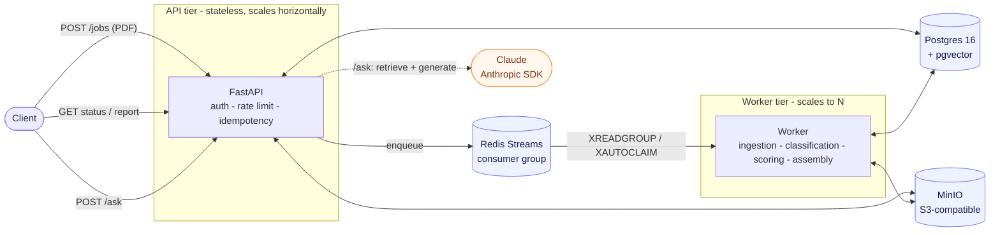
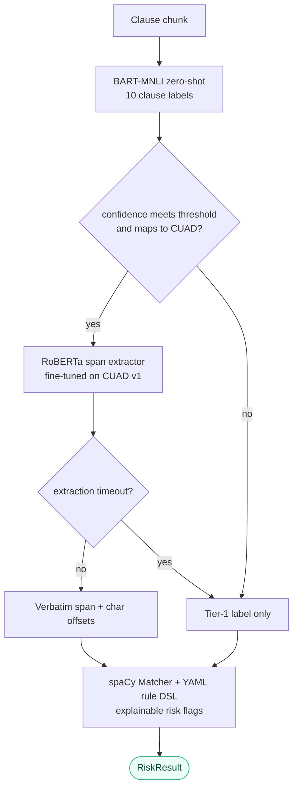
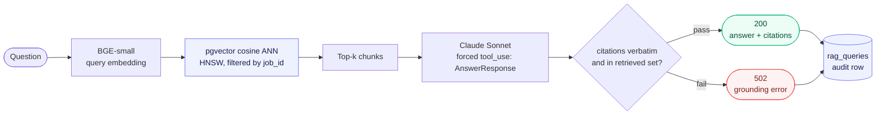

<div align="center">

# Verity

**A fault-tolerant contract-review pipeline: Redis Streams delivery that survives worker crashes, a fine-tuned RoBERTa span extractor, and a grounded RAG endpoint that refuses to fabricate.**

[](https://github.com/danielhansenjones/verity/actions/workflows/ci.yml)
[](#results)
[](#results)

[](https://redis.io/docs/latest/develop/data-types/streams/)
[](cuad/README.md)
[](https://huggingface.co/Mjolnirslams/roberta-base-squad2-cuad)
[](#rag-query-flow-post-ask)
[](pyproject.toml)
[](LICENSE)

</div>


Verity accepts PDF contract uploads over a hardened REST API, queues each job on Redis Streams for async worker processing, and returns a structured risk report. A two-tier ML cascade drives it: BART-MNLI zero-shot clause classification gates a **fine-tuned RoBERTa** span extractor that pulls verbatim evidence spans with exact character offsets, and a spaCy rule layer adds explainable risk flags. A separate **grounded RAG** endpoint answers free-text questions against a contract and rejects any answer whose citations are not verbatim substrings of the retrieved text.

Delivery is **at-least-once**: Redis Streams consumer groups hold each job until it is acknowledged, and `XAUTOCLAIM` reclaims jobs from workers that crash mid-flight, so no in-flight job is silently lost. `POST /jobs` is idempotent, retries resume from the last completed pipeline stage rather than re-running ingestion, and a per-chunk extractor timeout degrades to the tier-1 label instead of failing the job. Everything here is measured: span extraction goes from 0.41 to 0.73 trimmed macro F1 after fine-tuning, the RAG endpoint scores 0.98 faithfulness under a cross-model **LLM-as-judge** harness, and a single worker sustains 9.6 jobs/min under Locust with zero server errors.

Legal contract review is slow and expensive.
Lawyers spend time locating clauses that a well-built system can classify and flag in seconds.
This pipeline handles that pre-screening layer: classify every clause, match risk patterns with exact character offsets, and extract verbatim spans from flagged sections using a model trained on 500 real contracts.
The goal is to automate the repetitive part and surface structured evidence so that review is faster and more consistent.
The judgment on what to negotiate stays with the lawyer.

## What it produces

Given a clause, the scorer emits risk flags that point at the exact triggering span, with character offsets into the source text so a reviewer can jump straight to it.

Input clause:

> The Administrative Agent shall have sole discretion to accelerate the Loans, and the Borrower shall indemnify and hold harmless each Lender from all losses.

Flags:

```json
[
  {"id": "unilateral_discretion", "severity": "high", "reason": "Unilateral decision right", "matched_text": "sole discretion", "start": 36, "end": 51},
  {"id": "broad_indemnification", "severity": "high", "reason": "Broad indemnification obligation", "matched_text": "indemnify and hold harmless", "start": 100, "end": 127}
]
```

`text[36:51]` is `"sole discretion"` and `text[100:127]` is `"indemnify and hold harmless"`. The offsets are exact, not approximate.

The `/ask` endpoint answers free-text questions and verifies every citation is a verbatim substring of the retrieved chunks before returning. A real answer from the eval set:

> **Q:** Who is the Administrative Agent under this agreement?
>
> **A:** The Administrative Agent is Bank of America, N.A.
>
> **Citation** - chunk `a9f0d1f5`, quote: BANK OF AMERICA, N.A., as administrative agent (the "Administrative Agent")

If a cited quote were not present verbatim in the retrieved text, the request would return `502` instead of the answer.

## Reliability

**At-least-once delivery.** Jobs sit in a Redis Streams consumer group and stay in the pending-entries list until `XACK`. A crashed worker's in-flight jobs are reclaimed by `XAUTOCLAIM` after a configurable idle threshold, so nothing is silently dropped.

**Idempotent submission.** `POST /jobs` dedups on a client-supplied or content-hash key. Two concurrent first-time submissions race at the database's unique constraint; the loser gets the winner's `job_id` back with `Idempotent-Replay: true` instead of a duplicate job.

**Stage-checkpointed retries.** The worker records which pipeline stage last completed. A retry resumes from there, so a transient scoring error does not re-run ingestion or classification.

**Hardened API.** Timing-safe key comparison (`hmac.compare_digest`), a pre-parse upload cap enforced in middleware (411 and 413 before multipart parsing starts), and per-IP rate limits with `Retry-After`.

**Measured under load.** Prometheus metrics on both tiers cover submissions, completions, per-stage duration and error counts, and queue depth. Under Locust, one worker sustains 9.6 jobs/min, submit latency holds at 14 ms p50 (62 ms under a 20 VU spike), and both runs record zero server errors. Rate limiting fires with `Retry-After`, and a span-extractor timeout degrades to tier-1 labels without failing the job.

## Architecture

Four tiers, deliberately separated. Each scales, fails, and deploys independently.



### Two-tier ML cascade

A cheap zero-shot classifier gates an expensive fine-tuned span extractor. Tier-2 only runs when tier-1 is confident and the clause maps to a CUAD category, and a per-chunk timeout degrades to the tier-1 label instead of failing the job.



### RAG query flow (POST /ask)

Every answer passes a grounding gate before it leaves the box: cited quotes must be verbatim substrings of retrieved chunks and cited ids must be in the retrieved set, or the request 502s. Each call is persisted to an audit table.



## Results

| Metric                              | Value                                                       |
|-------------------------------------|-------------------------------------------------------------|
| Span-extraction macro F1            | 0.41 zero-shot to 0.73 fine-tuned (RoBERTa-base on CUAD v1) |
| RAG faithfulness (LLM-as-judge)     | 0.982                                                       |
| Citation accuracy                   | 0.946                                                       |
| Completeness / refusal correctness  | 0.935 / 0.957                                               |
| Throughput, single worker           | 9.6 jobs/min                                                |
| Submit latency p50                  | 14 ms (62 ms under a 20 VU spike)                           |
| Server errors under load            | 0                                                           |
| Tests                               | 239                                                         |

Measurement dates: RAG eval scores are the full 46-case run from 2026-07-03, load figures are Locust runs against the 2026-05 build, and the test count is from a full local run on 2026-07-03.


*Per-category F1 across all 41 CUAD categories. Blue is BART-MNLI zero-shot; orange and green are fine-tuned RoBERTa (base and large). Fine-tuning closes the largest gaps on categories zero-shot barely handles (Anti-Assignment, Effective Date, Governing Law, Expiration Date).*

The RAG eval is a 46-case dataset across three contract genres (two credit agreements and one services agreement, sourced from SEC EDGAR). The judge model (`claude-haiku-4-5`) is deliberately different from the generator (`claude-sonnet-4-6`): no model grades its own output, which removes the same-model self-preference bias that same-family LLM-as-judge setups carry. Judge calls use strict tool use, so a malformed judgment cannot poison a run.

Four refusal cases are adversarial: they ask for clauses that are plausible for the genre but absent from the document, such as SLA credits or minimum insurance coverage in a services agreement. Two soft spots are documented. Refusal correctness (0.957) reflects one adversarial case answered with a cited "not specified in this agreement" instead of a refusal. Completeness (0.935) reflects retrieval misses on buried facts: when the relevant clause is not in the retrieved top-k, the system refuses or answers conservatively from what it did retrieve rather than fabricating. Full methodology is in [cuad/README.md](cuad/README.md).

## Stack

| Layer      | Technology                                | Purpose                                    |
|------------|-------------------------------------------|--------------------------------------------|
| API        | FastAPI                                   | Job submission, status, results, /ask      |
| Queue      | Redis Streams + consumer group            | At-least-once dispatch with crash recovery |
| Worker     | Python process                            | Pipeline execution                         |
| Database   | PostgreSQL + pgvector + SQLAlchemy        | Job state, chunks, embeddings, results     |
| Storage    | MinIO (S3-compatible)                     | Raw PDFs, report artifacts                 |
| ML         | HuggingFace Transformers                  | Clause classification + scoring            |
| Embeddings | sentence-transformers (BGE-small-en-v1.5) | 384-dim chunk + query embeddings           |
| RAG LLM    | Anthropic SDK (claude-sonnet-4-6)         | Structured answer + citation generation    |
| Container  | Docker Compose                            | Single-command local stack                 |

## Quick Start

```bash
cp .env.example .env
python scripts/run.py
```

Or directly via Docker:
```bash
docker compose up --build
```

| Service        | URL                        |
|----------------|----------------------------|
| API            | http://localhost:8000      |
| API docs       | http://localhost:8000/docs |
| MinIO console  | http://localhost:9001      |
| Postgres       | localhost:5432             |

**Set up the RAG endpoint backend (optional, only needed for `/ask`):**

Set `ANTHROPIC_API_KEY=sk-ant-...` in `.env`. Key from `console.anthropic.com` (separate from a Claude.ai subscription).

**Enable the tier-2 span extractor (optional):**

Out of the box the pipeline runs tier-1 zero-shot classification only. Tier-2 needs the fine-tuned model:

```bash
uv run hf download Mjolnirslams/roberta-base-squad2-cuad \
  --local-dir cuad/artifacts/models/roberta_base_squad2_cuad
```

Then set `SPAN_EXTRACTOR_ENABLED=true` in `.env`. To train it from scratch instead, run `uv run python cuad/run.py` (see [cuad/README.md](cuad/README.md)).

**Submit a job:**
```bash
curl -X POST http://localhost:8000/jobs \
  -F "file=@sample_contract.pdf"
```

**Check status:**
```bash
curl http://localhost:8000/jobs/{job_id}
```

**Get report:**
```bash
curl http://localhost:8000/jobs/{job_id}/report
```

**Seed sample jobs:**
```bash
docker compose exec api python tests/seed.py
```

## API

| Method | Route                   | Description                                                 |
|--------|-------------------------|-------------------------------------------------------------|
| POST   | `/jobs`                 | Upload PDF, enqueue job - returns `job_id`                  |
| GET    | `/jobs/{job_id}`        | Job status, stage, retry count, and error if any            |
| GET    | `/jobs/{job_id}/report` | Risk result + presigned MinIO URL for full report           |
| POST   | `/jobs/{job_id}/ask`    | Free-text question, returns answer + grounded citations     |
| GET    | `/jobs`                 | List recent jobs, optional `?status=` filter                |
| GET    | `/health`               | Postgres and Redis connectivity check                       |
| GET    | `/metrics`              | Prometheus exposition (public, unauthenticated)             |

`POST /jobs/{id}/ask` requires `ANTHROPIC_API_KEY` to be set; otherwise the endpoint returns `503`. The rest of the API works without it.

Auth, rate limits, idempotency semantics, full request/response shapes, and the pipeline internals are in [TECHNICAL.md](TECHNICAL.md).

### Audit log retention and sensitive data

The `rag_queries` table grows without bound: every `/ask` appends a row and nothing prunes them. Production deployments should set a retention window, 90 days is a reasonable default, and delete older rows on a schedule. No pruner ships with this repo.

Questions and stored answers can carry PII or commercially sensitive terms, written verbatim to `rag_queries.question` and `rag_queries.answer`. Deployments handling real contracts should enable Postgres encryption at rest, restrict the database role that can read this table to the principals that actually need audit access, and consider field-level redaction at write time if the exposure scope warrants it.

## CI

Three workflows run on push and pull request to `main`:

| Workflow     | Jobs                                                       |
|--------------|------------------------------------------------------------|
| `ci.yml`     | Flake8 lint, pytest                                        |
| `docker.yml` | Docker image build (validates the Dockerfile)              |
| `evals.yml`  | Frozen RAG eval subset, on PRs touching the RAG surface    |

## Pre-commit

```bash
pip install pre-commit
pre-commit install
```

Runs on every commit: Flake8 lint, trailing whitespace, EOF, YAML and TOML validation.

## Scripts

| Script              | Purpose                                    |
|---------------------|--------------------------------------------|
| `scripts/run.py`    | Start the full stack via Docker Compose    |
| `scripts/test.py`   | Run the pytest suite (no services needed)  |

Both are plain Python files. Point PyCharm's Run/Debug buttons directly at them.

## Deeper reading

- [TECHNICAL.md](TECHNICAL.md) - auth, limits, idempotency, metrics, pipeline stages, RAG layer, architecture and scaling numbers, CUAD v2 cascade, project structure, fault tolerance, design decisions.
- [cuad/README.md](cuad/README.md) - CUAD training hyperparameters, data split methodology, per-category F1 results.

## License

MIT. See [LICENSE](LICENSE).